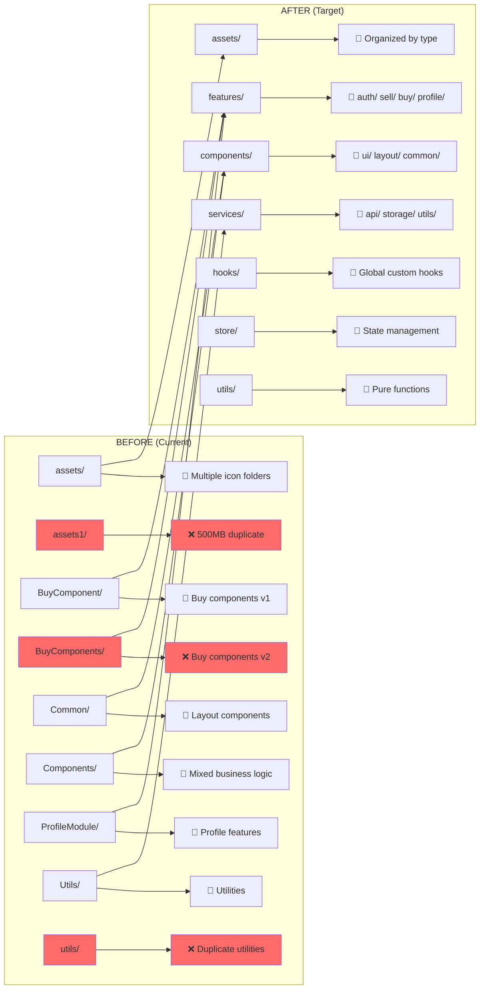

# Structure Transformation Guide

## 🔄 Visual Before → After Transformation

### Current Structure → Target Structure Mapping



## 📋 Detailed Component Migration Map

### 1. Layout Components Migration

| Current Location                 | Target Location                       | Action            |
| -------------------------------- | ------------------------------------- | ----------------- |
| `src/Common/Header/`             | `src/components/layout/Header/`       | **MOVE**          |
| `src/Common/Footer/`             | `src/components/layout/Footer/`       | **MOVE**          |
| `src/Common/BreadCrumb/`         | `src/components/layout/BreadCrumb/`   | **MOVE**          |
| `src/Common/MobileCommonHeader/` | `src/components/layout/MobileHeader/` | **MOVE + RENAME** |

### 2. UI Components Migration

| Current Location        | Target Location                    | Action   |
| ----------------------- | ---------------------------------- | -------- |
| `src/Shared/Slider/`    | `src/components/ui/Slider/`        | **MOVE** |
| `src/Common/Loader/`    | `src/components/ui/Loader/`        | **MOVE** |
| `src/Common/SearchBar/` | `src/components/ui/SearchBar/`     | **MOVE** |
| `src/Shared/BrandCard/` | `src/components/common/BrandCard/` | **MOVE** |

### 3. Feature Components Migration

#### Authentication Feature

| Current Location                       | Target Location                            | Action    |
| -------------------------------------- | ------------------------------------------ | --------- |
| `src/ProfileModule/Login/`             | `src/features/auth/components/LoginForm/`  | **MOVE**  |
| `src/ProfileModule/Signup/`            | `src/features/auth/components/SignupForm/` | **MOVE**  |
| `src/Components/ProfileModule2/Login/` | `src/features/auth/components/`            | **MERGE** |

#### Sell Feature

| Current Location                     | Target Location                                   | Action   |
| ------------------------------------ | ------------------------------------------------- | -------- |
| `src/Pages/SellModule/SellHome.jsx`  | `src/features/sell/pages/SellHomePage.jsx`        | **MOVE** |
| `src/Components/SelectBrand/`        | `src/features/sell/components/DeviceSelector/`    | **MOVE** |
| `src/Components/GetUpto/`            | `src/features/sell/components/PriceCalculator/`   | **MOVE** |
| `src/Pages/SellModule/FormStep3.jsx` | `src/features/sell/pages/PriceCalculatorPage.jsx` | **MOVE** |

#### Buy Feature

| Current Location                | Target Location                          | Action    |
| ------------------------------- | ---------------------------------------- | --------- |
| `src/BuyComponent/HomePage.jsx` | `src/features/buy/pages/BuyHomePage.jsx` | **MOVE**  |
| `src/BuyComponent/Cards/`       | `src/features/buy/components/`           | **MOVE**  |
| `src/BuyComponents/`            | `src/features/buy/components/`           | **MERGE** |

#### Profile Feature

| Current Location                    | Target Location                                | Action    |
| ----------------------------------- | ---------------------------------------------- | --------- |
| `src/ProfileModule/ProfileCard.jsx` | `src/features/profile/pages/ProfilePage.jsx`   | **MOVE**  |
| `src/ProfileModule/Address/`        | `src/features/profile/components/AddressForm/` | **MOVE**  |
| `src/ProfileModule/MyOrder/`        | `src/features/profile/pages/OrdersPage.jsx`    | **MOVE**  |
| `src/Components/ProfileModule2/`    | `src/features/profile/`                        | **MERGE** |

#### Checkout Feature

| Current Location           | Target Location                                 | Action   |
| -------------------------- | ----------------------------------------------- | -------- |
| `src/Components/CheckOut/` | `src/features/checkout/pages/CheckoutPage.jsx`  | **MOVE** |
| `src/Components/Payment/`  | `src/features/checkout/components/PaymentForm/` | **MOVE** |

### 4. Asset Reorganization

#### Current Asset Structure (Problematic)

```
src/assets/
├── css/ (legacy)
├── flaticons/
├── icons/ (100+ files)
├── images/
│   ├── brandlogos/
│   ├── icons/ (duplicate)
│   ├── Products/
│   └── static/
├── kicons/
├── kimages/
├── newicons/
├── QuickSellNewIcons/
├── TopSellingBrands/
├── TopSellingModels/
└── [50+ loose files]

src/assets1/ (❌ COMPLETE DUPLICATE)
```

#### Target Asset Structure (Organized)

```
src/assets/
├── icons/
│   ├── brands/
│   ├── ui/
│   ├── social/
│   └── navigation/
├── images/
│   ├── products/
│   ├── banners/
│   ├── brands/
│   └── static/
└── fonts/
```

## 🔧 Step-by-Step Transformation Process

### Phase 1: Critical Cleanup (Days 1-3)

#### Before Cleanup

```
Project Size: ~2.5GB
├── src/assets/ (500MB)
├── src/assets1/ (500MB) ❌ DUPLICATE
├── Archive files (50MB) ❌ WASTE
├── Duplicate components (200MB)
└── Application code (1.25GB)
```

#### After Cleanup

```
Project Size: ~1.5GB (40% reduction)
├── src/assets/ (500MB)
├── Consolidated components (150MB)
└── Application code (850MB)
```

### Phase 2: Structure Foundation (Days 4-7)

#### Create New Folder Structure

```bash
# Before: Flat, disorganized structure
src/
├── 15+ top-level folders
├── Mixed naming conventions
├── No clear hierarchy
└── Duplicate functionality

# After: Hierarchical, organized structure
src/
├── app/ (App configuration)
├── components/ (Reusable UI)
├── features/ (Business logic)
├── hooks/ (Custom hooks)
├── services/ (API & external)
├── store/ (State management)
├── utils/ (Pure functions)
└── assets/ (Static files)
```

### Phase 3: Feature Migration (Days 8-12)

#### Authentication Feature Transformation

```
BEFORE:
src/ProfileModule/Login/Login.jsx
src/ProfileModule/Signup/Signup.jsx
src/Components/ProfileModule2/Login/Login.jsx (duplicate)

AFTER:
src/features/auth/
├── components/
│   ├── LoginForm/
│   └── SignupForm/
├── hooks/
│   └── useAuth.js
├── services/
│   └── authService.js
└── pages/
    ├── LoginPage.jsx
    └── SignupPage.jsx
```

#### Sell Feature Transformation

```
BEFORE:
src/Pages/SellModule/ (8 files)
src/Components/SelectBrand/
src/Components/GetUpto/
src/Components/SellBanner/

AFTER:
src/features/sell/
├── components/
│   ├── DeviceSelector/
│   ├── PriceCalculator/
│   └── SellBanner/
├── hooks/
│   ├── useDevicePrice.js
│   └── useSellFlow.js
├── services/
│   └── sellService.js
└── pages/
    ├── SellHomePage.jsx
    ├── DeviceSelectionPage.jsx
    └── PriceCalculatorPage.jsx
```

### Phase 4: Component Consolidation (Days 13-15)

#### Buy Components Merge

```
BEFORE:
src/BuyComponent/ (v1)
├── Cards/
├── HomeSlider/
├── Services/
└── HomePage.jsx

src/BuyComponents/ (v2) ❌ DUPLICATE
├── HomeSlider/ (different implementation)
├── OurService/
└── TopSellingProducts/

AFTER:
src/features/buy/
├── components/
│   ├── ProductCards/
│   ├── HomeSlider/ (best implementation)
│   ├── Services/
│   └── TopSellingProducts/
└── pages/
    └── BuyHomePage.jsx
```

## 📊 Import Path Transformation

### Before: Complex, Inconsistent Imports

```javascript
// Deeply nested imports
import Header from "../../Common/Header/Header";
import Footer from "../../Common/Footer/Footer";
import BrandCard from "../../../Shared/BrandCard/BrandCard";
import { selectBrand } from "../../../../Components/SelectBrand/SelectBrand";

// Mixed naming conventions
import Login from "../../ProfileModule/Login/Login";
import Login2 from "../../Components/ProfileModule2/Login/Login";
```

### After: Clean, Consistent Imports

```javascript
// Clean barrel exports
import { Header, Footer } from "@/components/layout";
import { BrandCard } from "@/components/common";
import { DeviceSelector } from "@/features/sell";

// Feature-based imports
import { LoginForm } from "@/features/auth";
import { useAuth } from "@/features/auth/hooks";
```

## 🎯 Configuration Updates

### Vite Configuration Enhancement

```javascript
// Before: Basic configuration
export default defineConfig({
  plugins: [react()],
});

// After: Optimized with aliases
export default defineConfig({
  plugins: [react()],
  resolve: {
    alias: {
      '@': path.resolve(__dirname, './src'),
      '@/components': path.resolve(__dirname, './src/components'),
      '@/features': path.resolve(__dirname, './src/features'),
      '@/utils': path.resolve(__dirname, './src/utils'),
      '@/assets': path.resolve(__dirname, './src/assets'),
    }
  },
  build: {
    rollupOptions: {
      output: {
        manualChunks: {
          vendor: ['react', 'react-dom'],
          auth: ['./src/features/auth'],
          sell: ['./src/features/sell'],
          buy: ['./src/features/buy'],
        }
      }
    }
  }
});
```

### Package.json Scripts Enhancement

```json
{
  "scripts": {
    "dev": "vite",
    "build": "vite build",
    "preview": "vite preview",
    "analyze": "vite-bundle-analyzer",
    "migrate": "./migration-scripts/migrate.sh",
    "test:migration": "npm run build && npm run dev"
  }
}
```

## 📈 Performance Impact Visualization

### Bundle Size Comparison

```
BEFORE Migration:
┌─────────────────────────────────────┐
│ Total Bundle: ~20MB                 │
├─────────────────────────────────────┤
│ ████████████ Duplicates (50%)       │
│ ██████ Assets (30%)                 │
│ ████ Code (20%)                     │
└─────────────────────────────────────┘

AFTER Migration:
┌─────────────────────────────────────┐
│ Total Bundle: ~8MB (60% reduction)  │
├─────────────────────────────────────┤
│ ████████████ Assets (60%)           │
│ ████████ Code (40%)                 │
│ Duplicates (0%)                     │
└─────────────────────────────────────┘
```

### Build Time Comparison

```
BEFORE: ████████████████████████████████████████████████ 45s
AFTER:  ████████████████████████ 20s (55% improvement)
```

### Developer Experience Score

```
Code Organization:     3/10 → 9/10 ████████████████████
Component Discovery:   2/10 → 9/10 ████████████████████
Import Simplicity:     4/10 → 9/10 ████████████████████
Build Performance:     5/10 → 9/10 ████████████████████
Maintainability:       4/10 → 9/10 ████████████████████
```

## 🚀 Migration Success Indicators

### Week 1 Milestones

- [ ] ✅ 500MB+ disk space freed
- [ ] ✅ No duplicate folders
- [ ] ✅ Clean startup process
- [ ] ✅ All imports resolve correctly

### Week 2 Milestones

- [ ] ✅ Feature-based architecture implemented
- [ ] ✅ All components migrated successfully
- [ ] ✅ No duplicate functionality
- [ ] ✅ Path aliases working

### Week 3 Milestones

- [ ] ✅ Performance targets met
- [ ] ✅ All tests passing
- [ ] ✅ Documentation updated
- [ ] ✅ Production ready

## 🎉 Post-Migration Benefits

### Immediate Developer Benefits

1. **Faster Navigation** - Find components in seconds, not minutes
2. **Cleaner Imports** - No more `../../../` import paths
3. **Better Organization** - Logical grouping of related functionality
4. **Reduced Confusion** - No more duplicate or versioned components

### Long-term Project Benefits

1. **Scalability** - Easy to add new features without conflicts
2. **Maintainability** - Clear separation of concerns
3. **Performance** - Optimized bundle size and loading
4. **Team Productivity** - Faster development and onboarding

This transformation guide provides a clear visual representation of how your project will evolve from its current disorganized state to a modern, maintainable architecture.
